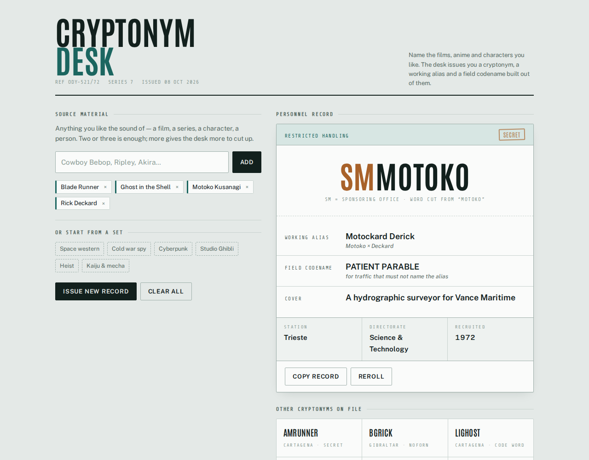
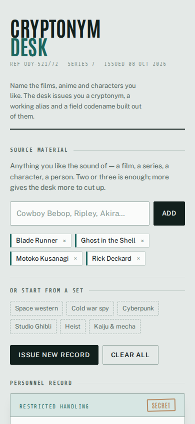
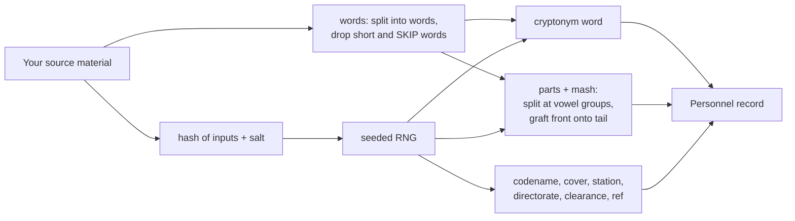

# Cryptonym Desk

Name the films, anime and characters you like, and the desk issues you a cryptonym, a working alias and a field codename cut from them. One HTML file that runs in your browser.



[](LICENSE)


Live copy: **[cryptonym.cn1-lab.uk](https://cryptonym.cn1-lab.uk)** (served from this repo by GitHub Pages).

## What it does

- Takes your source material (titles, characters, people) as chips you add or remove.
- Issues a **cryptonym**: a two-letter digraph naming the "sponsoring office", then a word cut from your material (`SMMOTOKO`).
- Issues a **working alias** that reads like a person's name, by grafting the front of one of your words onto the tail of another, and shows which two it cut together (`Motoko × Deckard`).
- Issues a **field codename** in ADJECTIVE NOUN form (`PATIENT PARABLE`), for traffic that must not name the alias.
- Fills in the rest of the record: cover job and firm, station, directorate, clearance stamp, year recruited and a file reference.
- Lists six alternative cryptonyms; click one to promote it to the record.
- Six presets to start from (Space western, Cold war spy, Cyberpunk, Studio Ghibli, Heist, Kaiju & mecha), plus Copy record and Reroll.

## Screenshots

| Desktop | Phone |
|---|---|
|  |  |
| 1280 px wide, Cyberpunk preset. | 390 px wide, same inputs. |

Both are Playwright captures of `index.html` opened from disk, as shipped in this repo.

## Quick start

You need a web browser. Nothing else.

```bash
git clone https://github.com/casareanderson/cryptonym-desk
cd cryptonym-desk
open index.html          # macOS; on Linux use xdg-open, on Windows start
```

Success looks like the screenshot above: the page opens on the Cyberpunk preset with a record already issued. It works from `file://`, so there is no server to run.

## Usage

1. Type something you like into **Source material** and press **Add**. Commas split one entry into several.
2. Or pick a set under **Or start from a set**.
3. Read the record. **Reroll** steps to a different record for the same material; **Issue new record** jumps to a random one.
4. Click any card under **Other cryptonyms on file** to make it the record.
5. **Copy record** puts a plain-text version on your clipboard:

```
SMMOTOKO
Working alias:   Motockard Derick
Field codename:  PATIENT PARABLE
Cover:           A hydrographic surveyor for Vance Maritime
Station:         Trieste
Directorate:     Science & Technology
Clearance:       SECRET
File:            ODY-521/72
```

Tips: full names beat single short words, because they give the splitter more consonant clusters to cut at. Three or four pieces of material is plenty, and mixing sources (a title, a character, a person) gives better seams than four titles from one show.

## Configuration

There are no settings or environment variables. The word banks are plain arrays at the top of the `<script>` block in `index.html`; edit them to change what the desk can draw from.

| Array | What it holds |
|---|---|
| `DIGRAPHS` | Office prefixes for the cryptonym (`AE`, `QK`, `LI` and others) |
| `STATIONS`, `DIRECTORATES`, `CLEARANCES` | The record's furniture |
| `COVER_ROLE`, `COVER_FIRM` | Cover job and the firm it is for |
| `ADJ`, `NOUN` | The two halves of the field codename |
| `PRESETS` | The six starter sets |
| `SKIP` | Short words dropped before cutting (`the`, `of`, `and` ...) |

## How it works



**The mashup.** Each word is split at its vowel groups, with trailing consonants staying on the last part:

```
Spiegel  ->  ["Spie", "gel"]
Kusanagi ->  ["Ku", "sa", "na", "gi"]

front of one + tail of the other  ->  "Spienagi"
```

The splitter is crude on purpose. A proper syllabifier gives tidier seams and duller names. A tripled letter at the seam is collapsed, so you get `Rippley`, not `Ripppley`.

**Determinism.** Every record comes from an xorshift RNG seeded with an FNV-1a hash of your inputs plus a salt. A fresh page starts with the same salt, so the same material gives the same record each time you open it. **Reroll** and **Issue new record** change the salt (the second one by a random amount), which is how you get variety.

**Privacy.** The script makes no network requests and stores nothing. The only external request is the Google Fonts stylesheet for the typefaces.

```
cryptonym-desk/
├── index.html    the whole app: markup, styles, word banks and script
├── CNAME         custom domain for GitHub Pages
├── docs/         README screenshots
└── LICENSE
```

## Status and limits

- Working, and served live at the address above.
- **Changed in 2026-09:** the splitter now matches the description above (`Spiegel` splits as `Spie·gel`, not `Spieg·el`), so `Spienagi` can come out. Aliases for the same inputs differ from earlier versions. The noun bank also listed `MERIDIAN` twice; the duplicate is gone, which shifts some codenames.
- The splitter only treats `a e i o u` as vowels, so names built round `y` or accented letters cut less well. Non-Latin letters are dropped when words are split.
- The digraphs are real ones from declassified files; the stations, cover firms and codename words are invented for the desk. No record means anything.
- There are no automated tests in this repo.

## Licence and credits

MIT, see [LICENSE](LICENSE).

Typefaces Antonio, Public Sans and Share Tech Mono are loaded from Google Fonts and are under the SIL Open Font License.

More field notes from the same author: [dev.to/c1-anderson](https://dev.to/c1-anderson).
